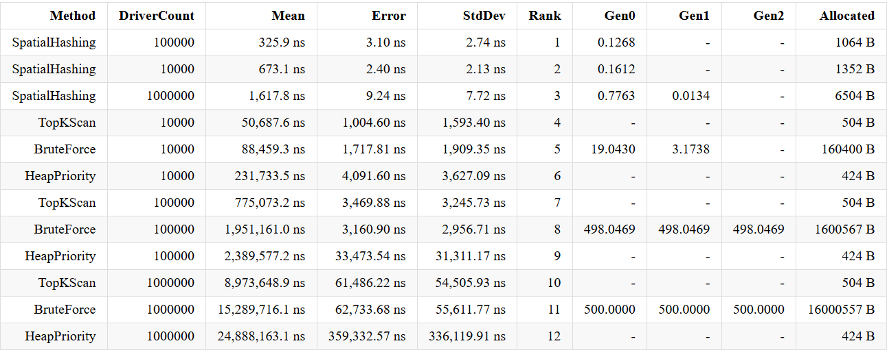

Taxi Radar

Описание задачи:
Необходимо найти 5 ближайших водителей к точке заказа на прямоугольной сетке размером N×M, где каждая клетка 1×1 может содержать не более одного водителя. Координаты задаются целыми числами X и Y (0 ≤ X < N, 0 ≤ Y < M).

Реализованные алгоритмы

 1. BruteForce (Прямой перебор)
Принцип работы: 
Вычисляется расстояние от заказа до всех водителей, после чего список сортируется по возрастанию расстояния и возвращаются первые 5 элементов.

Преимущества:
- Простота реализации
- Предсказуемое время выполнения
- Хорошо работает на малых данных (<10,000 водителей)

Недостатки:
- Высокая вычислительная сложность O(D log D), где D - количество водителей
- Огромное потребление памяти (160 MB на 1M водителей)
- Сортирует весь список, даже если нужно только 5 элементов

2. HeapPriority (Приоритетная очередь)
Принцип работы:
Используется структура данных PriorityQueue для поддержания топ-5 ближайших водителей. При добавлении нового водителя, если куча переполнена, удаляется самый дальний элемент.

Преимущества:
- Минимальное потребление памяти (всего 424 байта)
- Сложность O(D log K), где K=5 (константа)
- Не хранит лишних элементов

Недостатки:
- Накладные расходы на операции с кучей
- Медленнее BruteForce на практике
- Сложнее в реализации, чем простой перебор

3. TopKScan (Сканирование с поддержанием топ-K)
Принцип работы:
Поддерживается отсортированный список из K элементов. Для каждого нового водителя:
1. Вычисляется расстояние
2. Если список заполнен и водитель дальше текущего порога - пропускаем
3. Иначе вставляем на правильную позицию (сдвигая элементы)
4. Если список переполнен — удаляем последнего

Преимущества:
- Отличный баланс скорости и простоты
- В 1.7-2.5 раза быстрее BruteForce
- Потребление памяти в 317 раз меньше (504 B vs 160 MB)
- Простая оптимизация

Недостатки:
- Вставка в середину списка требует сдвига элементов O(K)
- Всё ещё проверяет всех водителей
- На очень больших данных уступает индексным методам

4. SpatialHashing (Пространственное хеширование)

Принцип работы:
1. Карта разбивается на ячейки
2. Водители распределяются по ячейкам (Dictionary: координата ячейки + список водителей)
3. Поиск начинается с ячейки заказа и расширяется по кольцам
4. Как только найдено достаточно кандидатов — остановка

Преимущества:
- Абсолютный лидер по скорости (в 9,500 раз быстрее BruteForce на 1M)
- Малое потребление памяти (1-6 KB)
- Проверяет только локальную область, а не всех водителей
- Масштабируется на огромные карты

Недостатки:
- Сложнее в реализации
- Первый запрос медленный (построение индекса)

Результаты бенчмарков

Тестирование проводилось на .NET 8 с использованием "BenchmarkDotNet".  
Конфигурация: карта 10,000×10,000, поиск 5 ближайших водителей.

